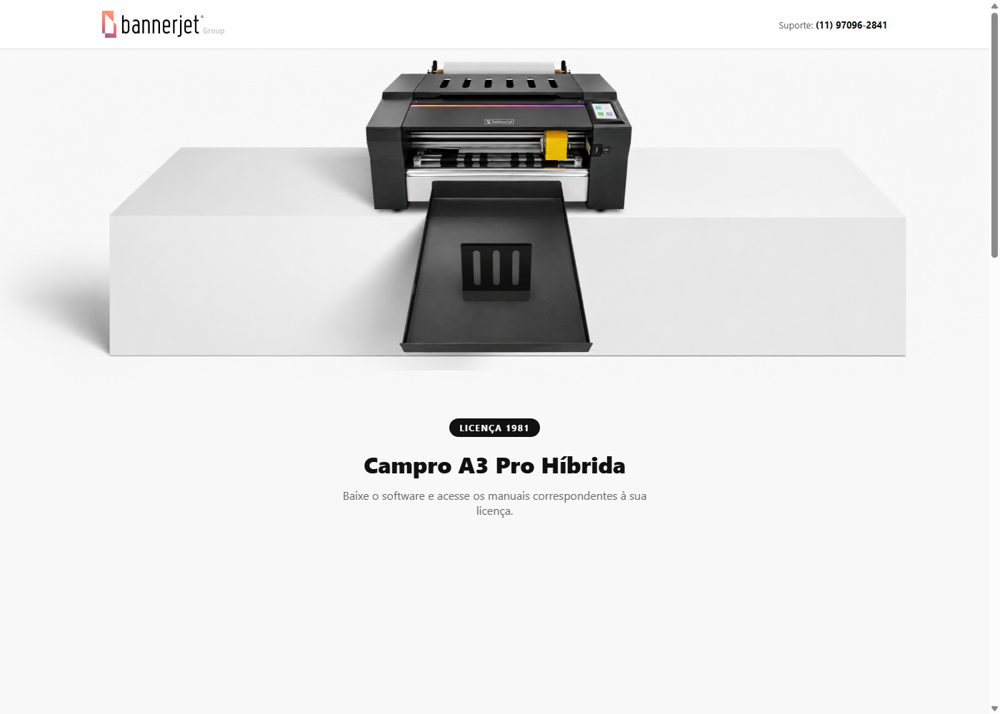
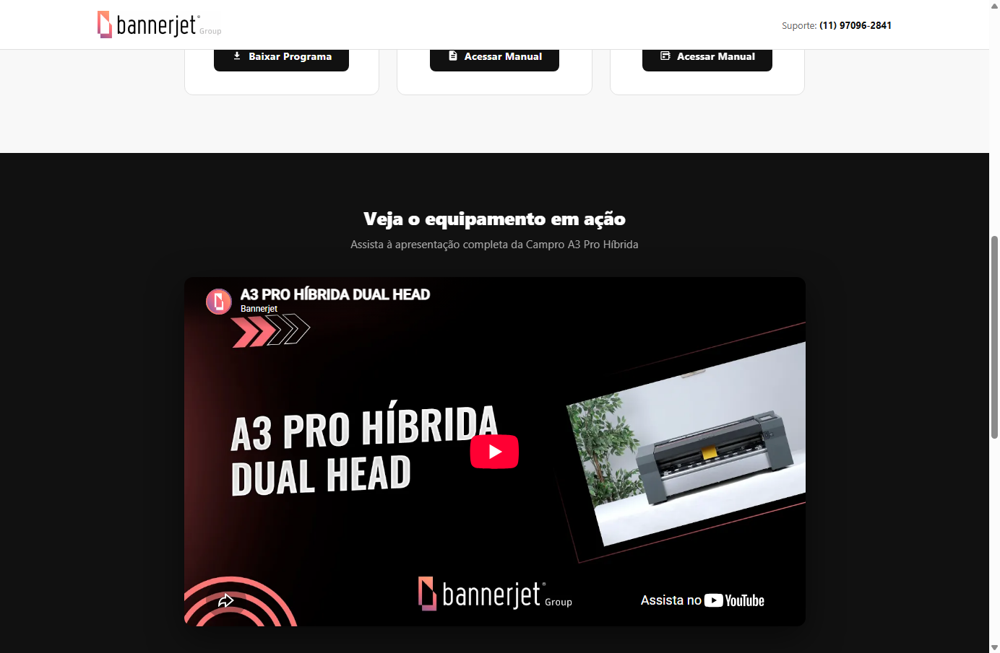
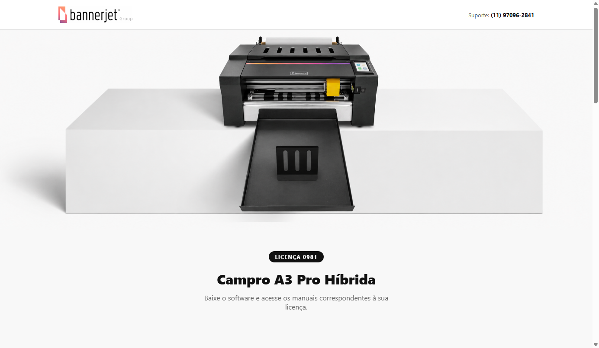
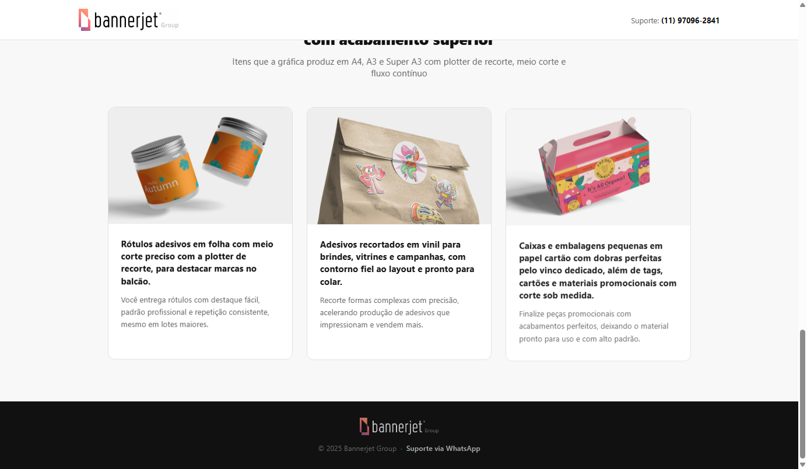

# Campro A3 Pro — Portal de Licença

Página de ativação e download para os equipamentos **Campro A3 Pro Híbrida** (Bannerjet Group): a partir do número de licença gravado no equipamento, o cliente acessa o software de corte, os manuais e vídeos de apresentação correspondentes à sua unidade.

🔗 **Portal:** [erickkadr.github.io/campro-a3-pro](https://erickkadr.github.io/campro-a3-pro/)

## Prints

| Página da licença | Downloads e vídeo de apresentação |
|---|---|
|  |  |

| Outra licença (0981) | Galeria de aplicações |
|---|---|
|  |  |

## Sobre o projeto

Cada Campro A3 Pro Híbrida vendida pela Bannerjet Group sai de fábrica com um número de licença (ex.: `1981`, `0981`). Esse número dá acesso a uma página dedicada — `/#/1981`, `/#/0981` — com o link de download do software de corte daquela licença, o manual de utilização, o manual do equipamento e um vídeo demonstrando o produto em uso. É, na prática, o "portal do cliente" de pós-venda do equipamento.

## Motivação

Substituir o processo manual de mandar manual e instalador por e-mail/WhatsApp a cada venda por um **link único e permanente por licença**, que o cliente pode acessar quando quiser — e que a equipe da Bannerjet pode atualizar centralizadamente (trocar o link do instalador, atualizar um manual) sem precisar reenviar nada.

## Funcionalidades

- Roteamento por número de licença (`/#/1981`, `/#/0981`, etc.) — cada um com seus próprios links de download
- Cards de recurso: baixar o programa de corte, acessar o manual de utilização e o manual do equipamento
- Seção de vídeo com a apresentação do equipamento
- Galeria de aplicações reais do equipamento (adesivos, embalagens, rótulos)
- Redirecionamento automático para uma licença padrão quando a rota não é reconhecida

## Tecnologias

- **React 18** + **TypeScript**
- **React Router** (`HashRouter` — compatível com hospedagem estática no GitHub Pages, sem precisar de configuração de servidor)
- **Vite** (build e dev server)
- **GitHub Pages** para deploy

## Estrutura do projeto

```
campro-a3-pro/
|-- src/
|   |-- App.tsx                 # Rotas por numero de licenca
|   |-- data/licenses.ts        # Dados de cada licenca (links de download/manuais)
|   |-- components/
|   |   |-- Header.tsx
|   |   |-- Hero.tsx
|   |   |-- ResourceCards.tsx   # Cards de download
|   |   |-- VideoSection.tsx
|   |   |-- Applications.tsx    # Galeria de aplicacoes
|   |   `-- Footer.tsx
|   |-- pages/LicensePage.tsx
|   `-- types/index.ts
`-- vite.config.ts
```

## Como rodar localmente

```bash
npm install
npm run dev
# acesse http://localhost:5173/#/1981
```

Build de produção:

```bash
npm run build
npm run preview
```

---

### Made with ♥ by Erick Dantas | [Contato](https://www.linkedin.com/in/erickkadr/)
